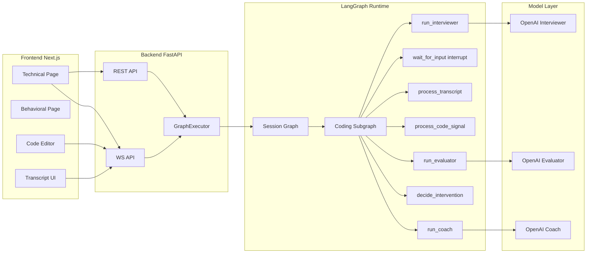
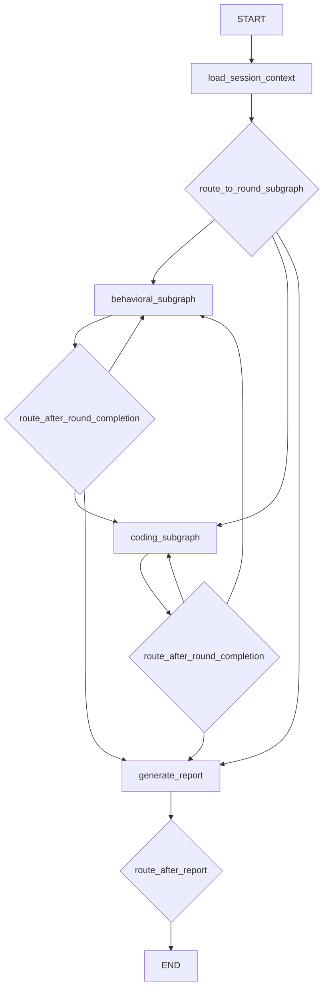
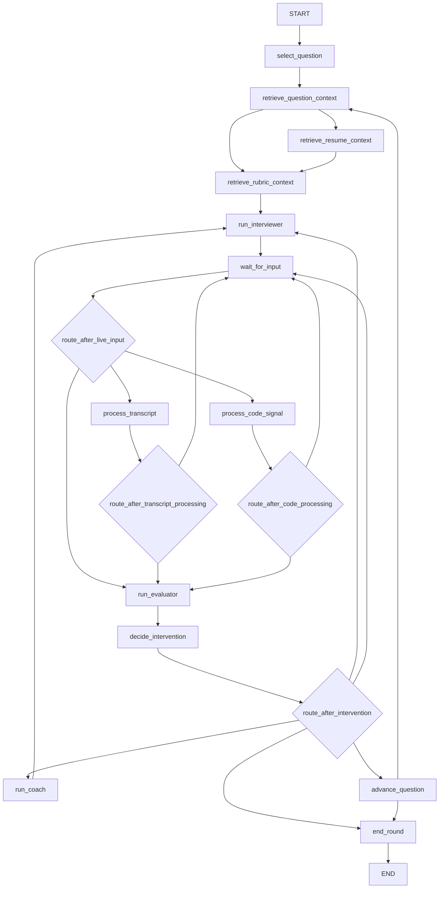
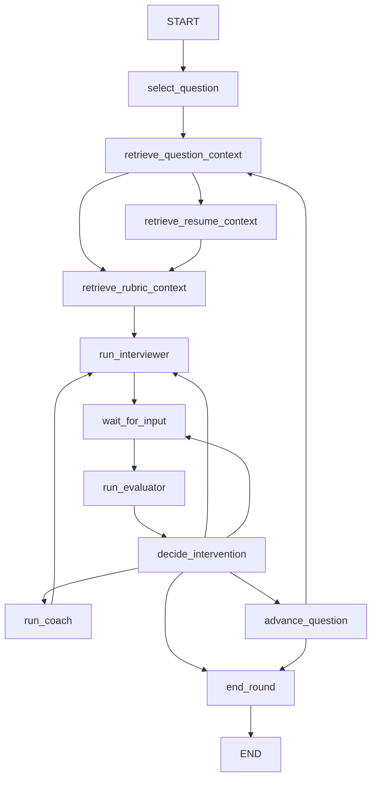

# Interview Agent

OpenAI-backed LangGraph interview runtime with a Next.js frontend and FastAPI backend.

## Quick Start

Run both servers:

```bash
# terminal 1
cd backend
.venv/bin/python run_dev.py

# terminal 2
cd ..
npm run dev
```

- Frontend: [http://localhost:3000](http://localhost:3000)
- Backend: [http://localhost:8000](http://localhost:8000)

## Current Scope

- Coding interview runtime is implemented with:
  - LangGraph orchestration (interviewer/evaluator/coach nodes)
  - interrupt/resume wait boundary
  - WS-driven transcript and code signal ingestion
  - checkpoint-backed graph execution
  - OpenAI agents via LangChain
- Behavioral page exists in frontend, but runtime deep orchestration is currently optimized for coding-first.

## High-Level Architecture



## Graph Visualizations

### Session Graph



### Coding Subgraph



### Behavioral Subgraph (current shape)



## Realtime Event Contracts (frontend -> backend)

Current WS event types used by frontend:

- `transcript.partial`
- `transcript.final`
- `code.changed`
- `code.run_completed`
- `ping`

Backend emits:

- `transcript.interviewer`
- `control.error`
- `pong`

## STT/TTS + OpenAI Plan

This is the next integration roadmap for real voice I/O while keeping LangGraph as the decision layer.

### Phase 1: STT Integration (ingest)

1. Browser captures microphone chunks (WebRTC/MediaRecorder).
2. Stream audio chunks to backend WS as `audio.chunk`.
3. Backend STT adapter transcribes partial/final text.
4. Convert STT output into `transcript.partial` / `transcript.final`.
5. Resume LangGraph on final transcript events.

Target files:

- `backend/app/api/v1/ws.py`
- `backend/app/realtime/event_contracts.py`
- `backend/app/services/transcript_service.py`
- `backend/app/langgraph/nodes/process_transcript.py`

### Phase 2: TTS Integration (egress)

1. `run_interviewer` emits text response.
2. TTS adapter generates audio URL/chunks for that response.
3. Backend emits `interviewer.utterance.created` with `audio_url`.
4. Frontend auto-plays response audio and updates transcript.

Target files:

- `backend/app/langgraph/nodes/run_interviewer.py`
- `backend/app/services/media_service.py`
- `backend/app/api/v1/ws.py`
- frontend voice playback component (`components/voice-agent.tsx`)

### Phase 3: Turn-Taking / Barge-In

1. Frontend sends user speaking state and VAD markers.
2. Runtime marks user as speaking (`transcript_window.user_current_state="speaking"`).
3. Interviewer node suppresses/halts response when interrupted.
4. On severe off-track evaluator signal, interviewer can emit short redirect interruption.

Target files:

- `backend/app/langgraph/nodes/run_interviewer.py`
- `backend/app/langgraph/nodes/run_evaluator.py`
- `backend/app/langgraph/nodes/decide_intervention.py`
- `backend/app/langgraph/state/shared_types.py`

### OpenAI Usage Boundaries

- OpenAI is the primary LLM backend for:
  - interviewer generation
  - evaluator scoring/recommendation
  - coach hints
- STT/TTS can be implemented with OpenAI or provider abstractions; keep adapter boundaries provider-agnostic in service/adapters layer.

## Notes

- Hidden answer data stays server-side via role-scoped retrieval refs.
- Persistence intents are written to runtime persistence sink for local durability.
- OpenAI runtime requires `OPENAI_API_KEY`.
